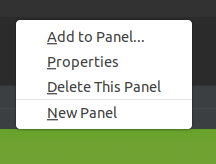
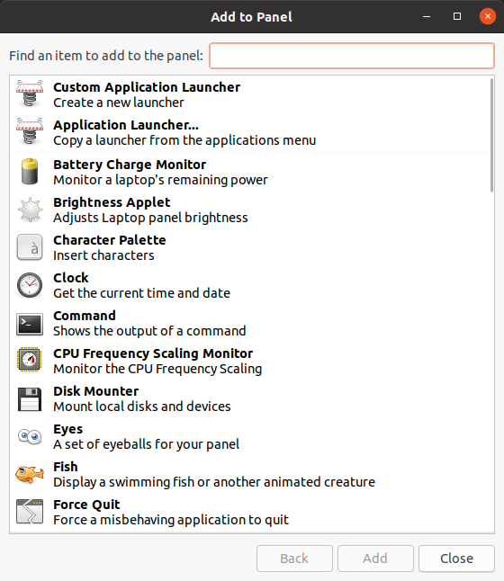

# About

GNOME Applets is part of the GNOME Flashback project and contains applets for use with
GNOME Panel. This includes applets for various tasks such as viewing the battery status,
viewing the cpu frequency or memory consumption, a weather applet and many more.

Please note that GNOME Panel also includes built-in applets such as the task list,
the application menu or the notification area, that are maintained directly in the
GNOME Panel source code.

Applets can be loaded by `gnome-panel` from a well-known system path and
can be added to a panel from the "Add to Panel..." dialog that can be accessed
from any panel's context menu by pressing `<Alt>+<Right Click>`
on an empty area of the panel:

Installed applets appear in the panel's "Add to Panel" dialog:

# Development

Applets should be written with the `libgnome-panel` library available since
gnome-panel 3.36 (for details see the
[libgnome-panel documentation](https://developer.gnome.org/libgnome-panel/)).

Older applets are still written with the `libpanel-applet` library that
is deprecated and will be removed from gnome-panel in the future (for details
see the [libpanel-applet documentation](https://developer.gnome.org/libpanel-applet)).

# Releases

You may download GNOME Applets releases and updates from the
[release server](https://download.gnome.org/sources/gnome-applets/).

# Requirements

See the section "Minimum library versions for GNOME Applets" in
[configure.ac](https://gitlab.gnome.org/GNOME/gnome-applets/blob/master/configure.ac).

# Discussions

To discuss gnome-panel, you may use the
[discussion forum](https://discourse.gnome.org/).

# Installation

See the INSTALL file. If you are not using a released version of
GNOME Panel (for example, if you checked out the code from git), you
first need to run './autogen.sh'.

# Reporting Bugs

Bug reports should be reported on the
[issue section](https://gitlab.gnome.org/GNOME/gnome-applets/issues) on GNOME's Gitlab server.
